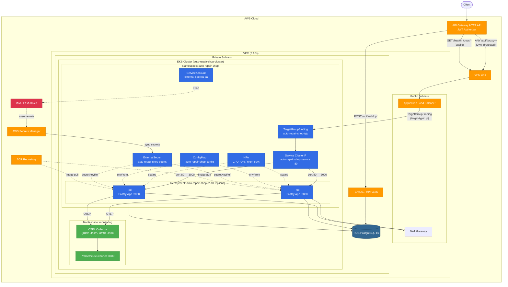
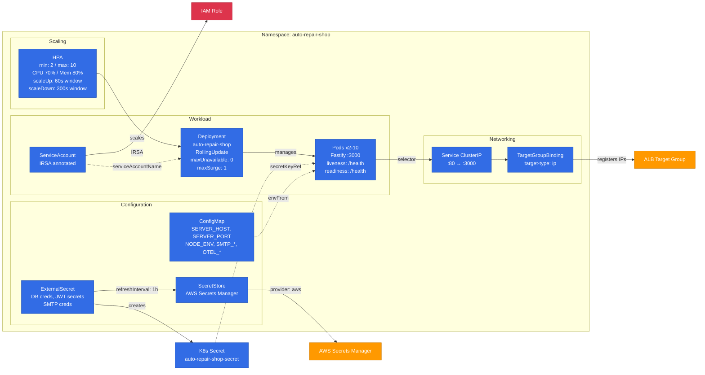
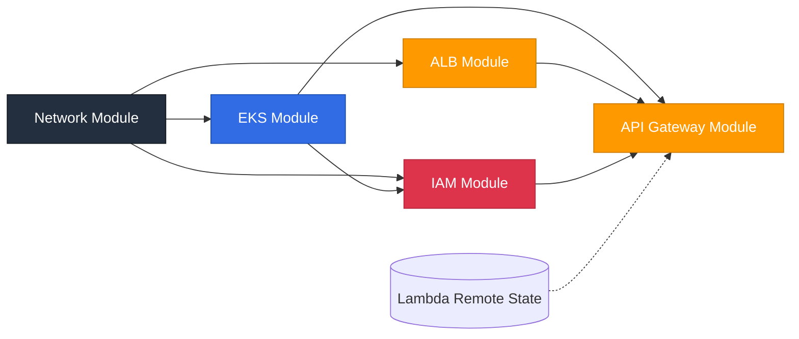

# Auto Repair Shop — K8s Infrastructure

Terraform modules for provisioning the core AWS infrastructure: VPC, EKS cluster, IAM roles (IRSA), Application Load Balancer, API Gateway (HTTP API with JWT authorizer), and Secrets Manager. This is the **foundation** of the Auto Repair Shop ecosystem and must be deployed first.

> **Part of the [Auto Repair Shop](https://github.com/fiap-13soat) ecosystem.**
> Deploy order: **K8s Infra (this repo)** → Lambda → DB → App

---

## Table of Contents

- [Purpose](#purpose)
- [Architecture](#architecture)
- [Technologies](#technologies)
- [Project Structure](#project-structure)
- [Getting Started](#getting-started)
- [CI/CD & Deployment](#cicd--deployment)
- [API Documentation](#api-documentation)
- [Related Repositories](#related-repositories)

---

## Purpose

This repository provisions all the AWS infrastructure required to run the Auto Repair Shop system:

- **VPC** with public and private subnets across 2 Availability Zones, NAT Gateways, and route tables
- **EKS** managed Kubernetes cluster with configurable node group for running the application
- **IAM** roles for EKS, and IRSA (IAM Roles for Service Accounts) for Secrets Manager and ALB Controller
- **ALB** (Application Load Balancer) with health-check target group, fronting the EKS cluster
- **API Gateway** (HTTP API v2) — single entry point for all clients, with JWT authorizer, VPC Link to ALB, and Lambda integration for CPF authentication
- **Secrets Manager** for securely storing and syncing application secrets to Kubernetes via ExternalSecrets

---

## Architecture

### Infrastructure & Kubernetes Overview



### Kubernetes Components Detail



### API Gateway Routing

| Route                | Target          | Auth         |
| -------------------- | --------------- | ------------ |
| `POST /api/auth/cpf` | Lambda function | Public       |
| `ANY /api/{proxy+}`  | ALB → EKS       | JWT required |
| `GET /health`        | ALB → EKS       | Public       |
| `GET /docs/{proxy+}` | ALB → EKS       | Public       |

### Module Dependency Graph



---

## Technologies

| Technology          | Version | Purpose                                    |
| ------------------- | ------- | ------------------------------------------ |
| **Terraform**       | ≥ 1.5.0 | Infrastructure as Code                     |
| **AWS EKS**         | —       | Managed Kubernetes cluster                 |
| **AWS VPC**         | —       | Network isolation (2 AZs, NAT)             |
| **AWS ALB**         | —       | Application Load Balancer                  |
| **AWS API GW v2**   | —       | HTTP API with JWT authorizer & VPC Link    |
| **AWS IAM**         | —       | Roles, policies, IRSA for pod-level access |
| **AWS Secrets Mgr** | —       | Application secrets store                  |
| **AWS Provider**    | ~5.0    | Terraform AWS resource management          |
| **TLS Provider**    | ~4.0    | TLS certificate handling                   |
| **S3**              | —       | Terraform state backend                    |
| **DynamoDB**        | —       | Terraform state locking                    |
| **GitHub Actions**  | —       | CI/CD pipeline                             |

---

## Project Structure

```
├── terraform/
│   ├── main.tf                    # Root module + Secrets Manager resources
│   ├── variables.tf               # Input variables
│   ├── outputs.tf                 # Exported values
│   ├── modules/
│   │   ├── network/               # VPC, subnets, NAT, route tables
│   │   │   ├── main.tf
│   │   │   ├── variables.tf
│   │   │   └── outputs.tf
│   │   ├── eks/                   # EKS cluster, managed node group, OIDC
│   │   │   ├── main.tf
│   │   │   ├── variables.tf
│   │   │   └── outputs.tf
│   │   ├── iam/                   # IAM roles, policies, IRSA
│   │   │   ├── main.tf
│   │   │   ├── variables.tf
│   │   │   └── outputs.tf
│   │   ├── alb/                   # Load balancer, target group
│   │   │   ├── main.tf
│   │   │   ├── variables.tf
│   │   │   └── outputs.tf
│   │   └── api-gateway/           # HTTP API, routes, JWT authorizer, VPC Link
│   │       ├── main.tf
│   │       ├── variables.tf
│   │       └── outputs.tf
│   └── environments/
│       ├── staging/
│       │   ├── terraform.tfvars   # Staging configuration
│       │   └── backend.hcl        # Staging state backend config
│       └── production/
│           ├── terraform.tfvars   # Production configuration
│           └── backend.hcl        # Production state backend config
```

---

## Getting Started

### Prerequisites

- Terraform ≥ 1.5.0
- AWS CLI configured with appropriate credentials
- S3 bucket for state: `auto-repair-shop-terraform-state`
- DynamoDB table for locking: `auto-repair-shop-terraform-locks`

> **This is the first repository to deploy** in the ecosystem. No prior infrastructure is needed.

### Terraform Commands

```bash
cd terraform

# Initialize with backend config
terraform init -backend-config=environments/staging/backend.hcl

# Plan (staging)
terraform plan -var-file=environments/staging/terraform.tfvars

# Plan (production)
terraform plan -var-file=environments/production/terraform.tfvars -out=tfplan

# Apply
terraform apply tfplan
```

### Key Outputs

| Output                 | Description                             |
| ---------------------- | --------------------------------------- |
| `cluster_name`         | EKS cluster name                        |
| `cluster_endpoint`     | EKS API endpoint                        |
| `alb_dns_name`         | ALB DNS for health checks               |
| `api_gateway_endpoint` | Public API URL                          |
| `auth_lambda_arn`      | CPF auth Lambda ARN (from remote state) |
| `secrets_manager_name` | Application secrets ARN                 |

### Environment Configurations

| Parameter          | Staging     | Production  |
| ------------------ | ----------- | ----------- |
| Node instance type | t3.small    | t3.medium   |
| Min nodes          | 1           | 1           |
| Max nodes          | 3           | 5           |
| VPC CIDR           | 10.1.0.0/16 | 10.0.0.0/16 |

---

## CI/CD & Deployment

Deployed via GitHub Actions (`.github/workflows/deploy-infra.yml`):

| Stage          | Trigger                               | Approval             |
| -------------- | ------------------------------------- | -------------------- |
| **Staging**    | Push to `main` (path: `terraform/**`) | Automatic            |
| **Production** | After staging succeeds                | Manual approval gate |

The pipeline uses **OIDC-based AWS credential assumption** (no long-lived access keys).

---

## API Documentation

This is an infrastructure repository that provisions the **API Gateway** as the public entry point. It does not serve APIs directly.

For the full API documentation (Swagger UI), see the application repository:

> **Swagger UI**: Available at `http://localhost:3000/docs` when running the [App](https://github.com/vctrlima/fiap-13soat-auto-repair-shop-app).

---

## Related Repositories

This project is part of the **Auto Repair Shop** ecosystem. Deploy in this order:

| #   | Repository                                                                                                  | Description                                     |
| --- | ----------------------------------------------------------------------------------------------------------- | ----------------------------------------------- |
| 1   | **`fiap-13soat-auto-repair-shop-k8s`** (this repo)                                                          | AWS infrastructure (VPC, EKS, ALB, API Gateway) |
| 2   | [`fiap-13soat-auto-repair-shop-lambda`](https://github.com/vctrlima/fiap-13soat-auto-repair-shop-lambda) | CPF authentication Lambda function              |
| 3   | [`fiap-13soat-auto-repair-shop-db`](https://github.com/vctrlima/fiap-13soat-auto-repair-shop-db)         | Database infrastructure (RDS PostgreSQL)        |
| 4   | [`fiap-13soat-auto-repair-shop-app`](https://github.com/vctrlima/fiap-13soat-auto-repair-shop-app)       | Application API                                 |
