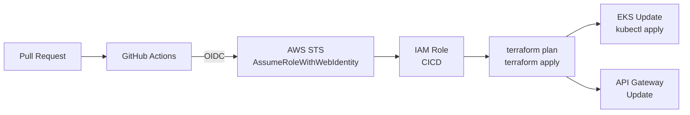
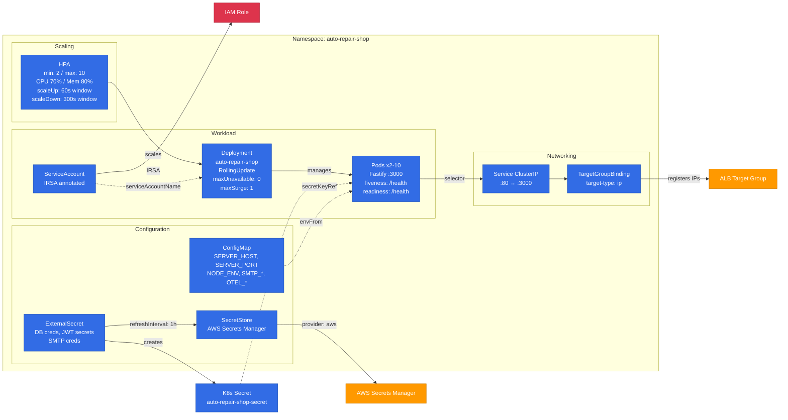
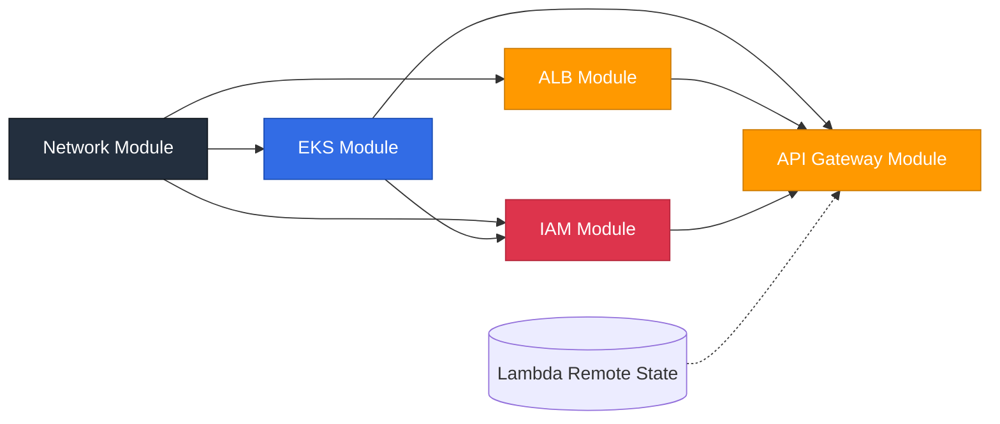

# K8s Infrastructure

> Módulos Terraform que provisionam a infraestrutura base da AWS para o ecossistema de oficina: VPC, EKS, IAM/IRSA, ALB, API Gateway HTTP v2 e Secrets Manager. **Deve ser o primeiro repositório a ser deployado** — todos os outros dependem de seus outputs.

## Sumário

- [1. Visão Geral](#1-visão-geral)
- [2. Arquitetura](#2-arquitetura)
- [3. Tecnologias Utilizadas](#3-tecnologias-utilizadas)
- [4. Comunicação entre Serviços](#4-comunicação-entre-serviços)
- [5. Diagramas](#5-diagramas)
- [6. Execução e Setup](#6-execução-e-setup)
- [7. Pontos de Atenção](#7-pontos-de-atenção)
- [8. Boas Práticas e Padrões](#8-boas-práticas-e-padrões)
- [9. Repositórios Relacionados](#9-repositórios-relacionados)

---

## 1. Visão Geral

### Propósito

O repositório `k8s` (infra) é responsável por provisionar toda a camada de infraestrutura de rede, computação e segurança sobre a qual os microserviços rodam:

1. **Rede** — VPC com subnets públicas e privadas em 2 AZs, NAT Gateway
2. **Computação** — Cluster EKS gerenciado com Node Groups auto-escaláveis
3. **Segurança** — IAM roles com IRSA (IAM Roles for Service Accounts) para acesso granular a serviços AWS
4. **Roteamento** — Application Load Balancer + VPC Link + API Gateway HTTP v2
5. **Secrets** — Secrets Manager + ExternalSecrets Operator (K8s → AWS Secrets Manager)

### Problema que Resolve

Sem uma infraestrutura centralizada e versionada, cada microserviço precisaria gerenciar rede, IAM e roteamento individualmente. Este repositório elimina esse problema:

- Um único cluster EKS para todos os microserviços (namespace `auto-repair-shop`)
- Um único API Gateway como ponto de entrada público com JWT authorizer
- IRSA garante que cada pod só acessa os recursos AWS que precisa
- State remoto compartilhado via S3/DynamoDB para outros repositórios Terraform

### Papel na Arquitetura

| Papel                | Descrição                                                                     |
| -------------------- | ----------------------------------------------------------------------------- |
| **Fundação**         | Deve ser o primeiro repo deployado — todos os outros dependem de seus outputs |
| **Ponto de entrada** | API Gateway roteia todas as requisições externas                              |
| **Autorizador**      | JWT Authorizer valida tokens antes de encaminhar para o EKS                   |
| **Provedor de rede** | VPC/subnets consumidos por Lambda e DB via remote state                       |

**Ordem de deploy**: **K8s Infra (este repo)** → Lambda → DB → Microserviços

---

## 2. Arquitetura

### Módulos Terraform

```
terraform/
├── main.tf              # Root module — orquestra todos os módulos
├── variables.tf
├── outputs.tf
├── environments/
│   ├── staging/
│   │   └── terraform.tfvars
│   └── production/
│       └── terraform.tfvars
└── modules/
    ├── network/          # VPC, subnets, IGW, NAT, route tables
    ├── eks/              # EKS cluster, node groups, OIDC provider
    ├── iam/              # IAM roles + sub-module irsa/
    │   └── irsa/         # Service account annotations por microserviço
    ├── alb/              # Application Load Balancer + Target Group + Listener
    └── api-gateway/      # API Gateway HTTP v2, integração ALB, JWT authorizer
```

### Decisões Arquiteturais

| Decisão                                   | Justificativa                                                              | Trade-off                                                                           |
| ----------------------------------------- | -------------------------------------------------------------------------- | ----------------------------------------------------------------------------------- |
| **EKS Managed Node Groups**               | AWS gerencia o provisionamento e atualização dos nós                       | Menos flexibilidade que self-managed; custo do plano de controle EKS                |
| **IRSA** (IAM Roles for Service Accounts) | Credenciais granulares por pod sem variáveis de ambiente                   | Requer OIDC configurado; complexidade adicional de IAM                              |
| **API Gateway HTTP v2**                   | Latência menor e custo menor que REST API; suporte a JWT authorizer nativo | Menos recursos que REST API; sem WAF nativo                                         |
| **VPC Link**                              | ALB privado (sem IP público); API Gateway acessa o EKS via rede interna    | Configuração mais complexa; ponto extra de latência                                 |
| **ExternalSecrets Operator**              | Secrets Manager → K8s Secret sincronizados automaticamente                 | Depende de CRD instalado no cluster; latência de sincronização                      |
| **HPA**                                   | Auto-scaling baseado em CPU/Memory sem intervenção manual                  | Requer métricas server instalado (`metrics-server`)                                 |
| **State remoto S3 + DynamoDB**            | Colaboração segura entre repositórios Terraform                            | Dependência de infraestrutura externa ao Terraform (o bucket S3 deve existir antes) |

### Rotas do API Gateway

| Método | Rota            | Destino                         | JWT Obrigatório |
| ------ | --------------- | ------------------------------- | --------------- |
| `POST` | `/api/auth/cpf` | Lambda (direto)                 | Não             |
| `ANY`  | `/api/{proxy+}` | ALB → EKS (roteamento por path) | Sim             |
| `GET`  | `/health`       | ALB → EKS                       | Não             |
| `GET`  | `/docs`         | ALB → EKS                       | Não             |

### Roteamento por Path no ALB

O ALB roteia requisições para Target Groups distintos com base no path:

| Prioridade | Paths                                                                           | Target Group (porta)      |
| ---------- | ------------------------------------------------------------------------------- | ------------------------- |
| 20         | `/api/customers*`, `/api/vehicles*`, `/internal/*`                              | Customer & Vehicle (3001) |
| 30         | `/api/work-orders*`, `/api/services*`, `/api/parts-or-supplies*`, `/api/sagas*` | Work Order (3002)         |
| 40         | `/api/invoices*`, `/api/payments*`                                              | Billing (3003)            |
| 50         | `/api/executions*`, `/api/notifications*`, `/api/metrics*`                      | Execution (3004)          |

---

## 3. Tecnologias Utilizadas

| Tecnologia                   | Versão  | Propósito                                         |
| ---------------------------- | ------- | ------------------------------------------------- |
| **Terraform**                | ≥ 1.9   | IaC — provisionamento AWS                         |
| **AWS EKS**                  | 1.32    | Cluster Kubernetes gerenciado                     |
| **AWS VPC**                  | —       | Rede isolada com subnets públicas/privadas        |
| **AWS ALB**                  | —       | Load balancer para o cluster EKS                  |
| **AWS API Gateway**          | HTTP v2 | Gateway público com JWT authorizer                |
| **AWS IAM / IRSA**           | —       | Roles granulares por Service Account              |
| **AWS Secrets Manager**      | —       | Armazenamento de secrets de produção              |
| **ExternalSecrets Operator** | —       | Sincronização Secrets Manager → K8s Secret        |
| **Kubernetes HPA**           | —       | Auto-scaling por CPU/Memory                       |
| **GitHub Actions**           | —       | CI/CD com OIDC (sem credenciais de longa duração) |

**Ambientes:**
| Parâmetro | Staging | Production |
|---|---|---|
| Instance type | `t3.small` | `t3.medium` |
| Nós EKS | 1–3 | 1–5 |

---

## 4. Comunicação entre Serviços

### Remote State Compartilhado

Este repositório expõe outputs via Terraform remote state, consumidos por outros repositórios:

| Output               | Consumidores         |
| -------------------- | -------------------- |
| `vpc_id`             | Lambda, DB           |
| `private_subnet_ids` | Lambda, DB           |
| `public_subnet_ids`  | ALB                  |
| `eks_cluster_name`   | CI/CD pipelines      |
| `api_gateway_url`    | Documentação, testes |

### Outputs Consumidos

| Repositório                           | Output Consumido             | Uso                             |
| ------------------------------------- | ---------------------------- | ------------------------------- |
| `fiap-13soat-auto-repair-shop-lambda` | `invoke_arn`, `function_arn` | Integração API Gateway → Lambda |

### Fluxo de Requisição (Runtime)

```
Client → API Gateway HTTP v2 → (JWT Authorizer) → VPC Link → ALB → EKS Ingress → Service → Pod
                            ↘ Lambda (rota /api/auth/cpf)
```

---

## 5. Diagramas

### Infraestrutura Geral

```mermaid
graph TD
    Client([Client])

    subgraph "AWS Cloud"
        subgraph "API Gateway HTTP v2"
            AGW[API Gateway\nJWT Authorizer]
            Auth[POST /api/auth/cpf\npúblico]
            API[ANY /api/{proxy+}\nJWT requerido]
        end

        subgraph "VPC"
            subgraph "Public Subnets"
                NAT[NAT Gateway]
                ALB[Application\nLoad Balancer]
            end
            subgraph "Private Subnets"
                subgraph "EKS Cluster"
                    NS[Namespace auto-repair-shop]
                    HPA[HPA\nmin:2 max:10]
                    Pods[Microservice Pods]
                end
                RDS[(RDS PostgreSQL)]
                LambdaVPC[Lambda\nCPF Auth]
            end
        end

        SM[Secrets Manager]
        ECR[ECR\nDocker Registry]
    end

    Client --> AGW
    AGW --> Auth --> LambdaVPC --> RDS
    AGW --> API --> ALB --> NS --> Pods
    Pods --> RDS
    SM -->|ExternalSecrets| NS
    ECR -->|pull| Pods
```

### Pipeline CI/CD


```mermaid
graph LR
    PR[Pull Request] --> GHA[GitHub Actions]
    GHA -->|OIDC| AWS[AWS STS\nAssumeRoleWithWebIdentity]
    AWS --> Role[IAM Role\nCICD]
    Role --> TF[terraform plan\nterraform apply]
    TF --> EKS[EKS Update\nkubectl apply]
    TF --> AGW[API Gateway\nUpdate]
```

---

## 6. Execução e Setup

### Pré-requisitos

- Terraform ≥ 1.9
- AWS CLI configurado com permissões de administrador
- `kubectl` para interagir com o cluster após provisão
- Bucket S3 e tabela DynamoDB de state criados (fora do Terraform)

### Inicialização

```bash
cd terraform

# Staging
terraform init \
  -backend-config="environments/staging/backend.tfvars"

# Production
terraform init \
  -backend-config="environments/production/backend.tfvars"
```

### Plan e Apply

```bash
# Staging
terraform plan -var-file="environments/staging/terraform.tfvars"
terraform apply -var-file="environments/staging/terraform.tfvars"

# Production
terraform plan -var-file="environments/production/terraform.tfvars"
terraform apply -var-file="environments/production/terraform.tfvars"
```

### Configurar kubectl

```bash
aws eks update-kubeconfig \
  --region us-east-1 \
  --name auto-repair-shop-cluster
```

### Variáveis Terraform

| Variável                  | Descrição                              |
| ------------------------- | -------------------------------------- |
| `aws_region`              | Região AWS                             |
| `environment`             | `staging` ou `production`              |
| `eks_cluster_name`        | Nome do cluster EKS                    |
| `eks_node_instance_type`  | Tipo de instância EC2                  |
| `eks_min_size / max_size` | Limites do node group                  |
| `lambda_invoke_arn`       | ARN da Lambda (input para API Gateway) |
| `jwt_audience`            | Audience do JWT para o authorizer      |

### State Backend

| Recurso        | Nome                               |
| -------------- | ---------------------------------- |
| S3 Bucket      | `auto-repair-shop-terraform-state` |
| DynamoDB Table | `auto-repair-shop-terraform-locks` |

---

## 7. Pontos de Atenção

### Ordem de Deploy Crítica

Este repositório **deve ser deployado primeiro**. A Lambda lê o remote state deste repositório para obter VPC/subnet IDs. O repositório DB faz o mesmo. Se `terraform apply` aqui falhar, os deployments subsequentes também falharão.

### IRSA e Anotações K8s

Cada microserviço precisa de uma `ServiceAccount` com a annotation `eks.amazonaws.com/role-arn` apontando para o IAM Role criado pelo módulo `iam/irsa`. Sem isso, pods não conseguem acessar SNS, SQS ou DynamoDB.

### ExternalSecrets Operator

O operador deve estar instalado no cluster antes de criar `ExternalSecret` CRDs. Se secrets não sincronizarem (status `SecretSyncedError`), verifique:

1. IRSA da ServiceAccount do operador tem permissão `secretsmanager:GetSecretValue`
2. O nome do secret no Secrets Manager está correto no CRD

### HPA e Metrics Server

O HPA requer que o `metrics-server` esteja instalado no cluster. Sem ele, o HPA fica em estado `Unknown` e não escala. Verifique com `kubectl top nodes`.

### Cold Start do API Gateway

O API Gateway HTTP v2 tem latência adicional de ~5ms (vs ALB direto). Para cargas muito altas, considere expor o ALB diretamente para chamadas inter-serviço.

---

## 8. Boas Práticas e Padrões

### Segurança

- **OIDC CI/CD** — sem credenciais AWS de longa duração em GitHub Secrets
- **IRSA** — princípio do menor privilégio por pod
- **Subnets privadas** — EKS, RDS e Lambda não têm IP público
- **JWT Authorizer** — validação centralizada no API Gateway

### Gestão de Estado

- Remote state com locking via DynamoDB — previne applies simultâneos
- Workspaces separados por ambiente (`staging`, `production`)
- `.terraform.lock.hcl` commitado para reproducibilidade

### Módulos Terraform

- Um módulo por responsabilidade (rede, EKS, IAM, ALB, API Gateway)
- Outputs explícitos em `outputs.tf` de cada módulo
- Inputs tipados e documentados em `variables.tf`

### Monitoramento

- CloudWatch Container Insights habilitado no EKS
- HPA com CPU threshold 70% e Memory threshold 80%
- Alertas CloudWatch para nós em estado `NotReady`

| Environment                  | URL                                        |
| ---------------------------- | ------------------------------------------ |
| **API Gateway (Production)** | `https://api.auto-repair-shop.com`         |
| **API Gateway (Staging)**    | `https://staging-api.auto-repair-shop.com` |

---

## Table of Contents

- [Purpose](#purpose)
- [Architecture](#architecture)
- [Technologies](#technologies)
- [Project Structure](#project-structure)
- [Getting Started](#getting-started)
- [CI/CD & Deployment](#cicd--deployment)
- [Documentation](#documentation)
- [API Documentation](#api-documentation)
- [Related Repositories](#related-repositories)

---

## Purpose

This repository provisions all the AWS infrastructure required to run the Auto Repair Shop system:

- **VPC** with public and private subnets across 2 Availability Zones, NAT Gateways, and route tables
- **EKS** managed Kubernetes cluster with configurable node group for running the application
- **IAM** roles for EKS, and IRSA (IAM Roles for Service Accounts) for Secrets Manager and ALB Controller
- **ALB** (Application Load Balancer) with health-check target group, fronting the EKS cluster
- **API Gateway** (HTTP API v2) — single entry point for all clients, with JWT authorizer, VPC Link to ALB, and Lambda integration for CPF authentication
- **Secrets Manager** for securely storing and syncing application secrets to Kubernetes via ExternalSecrets

---

## Architecture

### Infrastructure & Kubernetes Overview

```mermaid
graph TB
    Client([Client]) --> APIGW

    subgraph "AWS Cloud"
        APIGW[API Gateway HTTP API<br/>JWT Authorizer]

        subgraph "VPC (2 AZs)"
            subgraph "Public Subnets"
                NAT[NAT Gateway]
                ALB[Application Load Balancer]
            end

            subgraph "Private Subnets"
                Lambda[Lambda - CPF Auth]

                subgraph "EKS Cluster (auto-repair-shop-cluster)"

                    subgraph "Namespace: auto-repair-shop"
                        SA[ServiceAccount\nexternal-secrets-sa]

                        subgraph "Customer & Vehicle Service"
                            ExtSecret_CV[ExternalSecret\ncustomer-vehicle-secret]
                            Dep_CV[Deployment (2-10 replicas)\nFastify :3001]
                        end

                        subgraph "Work Order Service"
                            ExtSecret_WO[ExternalSecret\nwork-order-secret]
                            Dep_WO[Deployment (2-10 replicas)\nFastify :3002]
                        end

                        subgraph "Billing Service"
                            Dep_Bill[Deployment (2-10 replicas)\nFastify :3003]
                        end

                        subgraph "Execution Service"
                            ExtSecret_EX[ExternalSecret\nexecution-secret]
                            Dep_EX[Deployment (2-10 replicas)\nFastify :3004]
                        end

                        HPA[HPA per service\nCPU 70% / Mem 80%]
                    end

                    subgraph "Namespace: monitoring"
                        OTELCol[OTEL Collector\ngRPC :4317 / HTTP :4318]
                        OTELProm[Prometheus Exporter :8889]
                    end

                end
            end
        end

        VPCLink[VPC Link]
        SM[AWS Secrets Manager]
        IAM[IAM / IRSA Roles]
        ECR[ECR Repository]
    end

    %% External traffic
    APIGW -- "POST /api/auth/cpf" --> Lambda
    APIGW -- "ANY /api/{proxy+}\n(JWT protected)" --> VPCLink
    APIGW -- "GET /health, /docs/*\n(public)" --> VPCLink
    VPCLink --> ALB

    %% ALB path-based routing
    ALB -- "/api/customers*, /api/vehicles*, /internal/*" --> Dep_CV
    ALB -- "/api/work-orders*, /api/services*, /api/sagas*" --> Dep_WO
    ALB -- "/api/invoices*, /api/payments*" --> Dep_Bill
    ALB -- "/api/executions*, /api/notifications*" --> Dep_EX

    %% Lambda calls CVS internally
    Lambda -- "GET /internal/customers/:document" --> ALB
    TGB --> SVC
    SVC -- "port 80 → 3000" --> Pod1
    SVC -- "port 80 → 3000" --> Pod2

    %% HPA controls scaling
    HPA -. "scales" .-> Pod1
    HPA -. "scales" .-> Pod2

    %% Config injection
    CM -. "envFrom" .-> Pod1
    CM -. "envFrom" .-> Pod2
    ExtSecret -. "secretKeyRef" .-> Pod1
    ExtSecret -. "secretKeyRef" .-> Pod2

    %% ServiceAccount → IRSA
    SA -. "IRSA" .-> IAM
    IAM -. "assume role" .-> SM

    %% Secrets sync
    SM -- "sync secrets" --> ExtSecret

    %% Pod → external
    Pod1 --> RDS
    Pod2 --> RDS
    Pod1 -- "OTLP" --> OTELCol
    Pod2 -- "OTLP" --> OTELCol
    OTELCol --> OTELProm
    Lambda --> RDS

    %% ECR pull
    ECR -. "image pull" .-> Pod1
    ECR -. "image pull" .-> Pod2

    %% Outbound
    Pod1 --> NAT
    Pod2 --> NAT

    style APIGW fill:#ff9900,stroke:#cc7a00,color:#fff
    style ALB fill:#ff9900,stroke:#cc7a00,color:#fff
    style VPCLink fill:#ff9900,stroke:#cc7a00,color:#fff
    style Lambda fill:#ff9900,stroke:#cc7a00,color:#fff
    style SM fill:#ff9900,stroke:#cc7a00,color:#fff
    style IAM fill:#dd344c,stroke:#b52a3e,color:#fff
    style ECR fill:#ff9900,stroke:#cc7a00,color:#fff
    style RDS fill:#336791,stroke:#1a3d5c,color:#fff
    style Pod1 fill:#326ce5,stroke:#1a4db5,color:#fff
    style Pod2 fill:#326ce5,stroke:#1a4db5,color:#fff
    style SVC fill:#326ce5,stroke:#1a4db5,color:#fff
    style HPA fill:#326ce5,stroke:#1a4db5,color:#fff
    style TGB fill:#326ce5,stroke:#1a4db5,color:#fff
    style SA fill:#326ce5,stroke:#1a4db5,color:#fff
    style CM fill:#326ce5,stroke:#1a4db5,color:#fff
    style ExtSecret fill:#326ce5,stroke:#1a4db5,color:#fff
    style OTELCol fill:#4caf50,stroke:#388e3c,color:#fff
    style OTELProm fill:#4caf50,stroke:#388e3c,color:#fff
```

### Kubernetes Components Detail


```mermaid
graph LR
    subgraph "Namespace: auto-repair-shop"
        direction TB

        subgraph "Configuration"
            CM2[ConfigMap<br/>SERVER_HOST, SERVER_PORT<br/>NODE_ENV, SMTP_*, OTEL_*]
            ES[ExternalSecret<br/>DB creds, JWT secrets<br/>SMTP creds]
            SS[SecretStore<br/>AWS Secrets Manager]
        end

        subgraph "Workload"
            SA2[ServiceAccount<br/>IRSA annotated]
            Deploy[Deployment<br/>auto-repair-shop<br/>RollingUpdate<br/>maxUnavailable: 0<br/>maxSurge: 1]
            Pods[Pods x2-10<br/>Fastify :3000<br/>liveness: /health<br/>readiness: /health]
        end

        subgraph "Networking"
            SVC2[Service ClusterIP<br/>:80 → :3000]
            TGB2[TargetGroupBinding<br/>target-type: ip]
        end

        subgraph "Scaling"
            HPA2[HPA<br/>min: 2 / max: 10<br/>CPU 70% / Mem 80%<br/>scaleUp: 60s window<br/>scaleDown: 300s window]
        end
    end

    SS -- "provider: aws" --> SM2[AWS Secrets Manager]
    ES -- "refreshInterval: 1h" --> SS
    ES -- "creates" --> Secret2[K8s Secret<br/>auto-repair-shop-secret]

    SA2 -- "IRSA" --> IAM2[IAM Role]

    CM2 -. "envFrom" .-> Pods
    Secret2 -. "secretKeyRef" .-> Pods
    SA2 -. "serviceAccountName" .-> Deploy
    Deploy -- "manages" --> Pods
    HPA2 -- "scales" --> Deploy
    Pods -- "selector" --> SVC2
    SVC2 --> TGB2
    TGB2 -- "registers IPs" --> ALB2[ALB Target Group]

    style Deploy fill:#326ce5,stroke:#1a4db5,color:#fff
    style Pods fill:#326ce5,stroke:#1a4db5,color:#fff
    style SVC2 fill:#326ce5,stroke:#1a4db5,color:#fff
    style HPA2 fill:#326ce5,stroke:#1a4db5,color:#fff
    style TGB2 fill:#326ce5,stroke:#1a4db5,color:#fff
    style SA2 fill:#326ce5,stroke:#1a4db5,color:#fff
    style CM2 fill:#326ce5,stroke:#1a4db5,color:#fff
    style ES fill:#326ce5,stroke:#1a4db5,color:#fff
    style SS fill:#326ce5,stroke:#1a4db5,color:#fff
    style Secret2 fill:#326ce5,stroke:#1a4db5,color:#fff
    style SM2 fill:#ff9900,stroke:#cc7a00,color:#fff
    style IAM2 fill:#dd344c,stroke:#b52a3e,color:#fff
    style ALB2 fill:#ff9900,stroke:#cc7a00,color:#fff
```

### API Gateway Routing

| Route                | Target          | Auth         |
| -------------------- | --------------- | ------------ |
| `POST /api/auth/cpf` | Lambda function | Public       |
| `ANY /api/{proxy+}`  | ALB → EKS       | JWT required |
| `GET /health`        | ALB → EKS       | Public       |
| `GET /docs/{proxy+}` | ALB → EKS       | Public       |

### Module Dependency Graph


```mermaid
graph LR
    Network[Network Module] --> EKS[EKS Module]
    Network --> ALB[ALB Module]
    Network --> IAM[IAM Module]
    EKS --> IAM
    EKS --> APIGateway[API Gateway Module]
    ALB --> APIGateway
    IAM --> APIGateway
    LambdaState[(Lambda Remote State)] -.-> APIGateway

    style Network fill:#232f3e,stroke:#131920,color:#fff
    style EKS fill:#326ce5,stroke:#1a4db5,color:#fff
    style ALB fill:#ff9900,stroke:#cc7a00,color:#fff
    style APIGateway fill:#ff9900,stroke:#cc7a00,color:#fff
    style IAM fill:#dd344c,stroke:#b52a3e,color:#fff
```

---

## Technologies

| Technology          | Version | Purpose                                    |
| ------------------- | ------- | ------------------------------------------ |
| **Terraform**       | ≥ 1.5.0 | Infrastructure as Code                     |
| **AWS EKS**         | —       | Managed Kubernetes cluster                 |
| **AWS VPC**         | —       | Network isolation (2 AZs, NAT)             |
| **AWS ALB**         | —       | Application Load Balancer                  |
| **AWS API GW v2**   | —       | HTTP API with JWT authorizer & VPC Link    |
| **AWS IAM**         | —       | Roles, policies, IRSA for pod-level access |
| **AWS Secrets Mgr** | —       | Application secrets store                  |
| **AWS Provider**    | ~5.0    | Terraform AWS resource management          |
| **TLS Provider**    | ~4.0    | TLS certificate handling                   |
| **S3**              | —       | Terraform state backend                    |
| **DynamoDB**        | —       | Terraform state locking                    |
| **GitHub Actions**  | —       | CI/CD pipeline                             |

---

## Project Structure

```
├── terraform/
│   ├── main.tf                    # Root module + Secrets Manager resources
│   ├── variables.tf               # Input variables
│   ├── outputs.tf                 # Exported values
│   ├── modules/
│   │   ├── network/               # VPC, subnets, NAT, route tables
│   │   │   ├── main.tf
│   │   │   ├── variables.tf
│   │   │   └── outputs.tf
│   │   ├── eks/                   # EKS cluster, managed node group, OIDC
│   │   │   ├── main.tf
│   │   │   ├── variables.tf
│   │   │   └── outputs.tf
│   │   ├── iam/                   # IAM roles, policies, IRSA
│   │   │   ├── main.tf
│   │   │   ├── variables.tf
│   │   │   └── outputs.tf
│   │   ├── alb/                   # Load balancer, target group
│   │   │   ├── main.tf
│   │   │   ├── variables.tf
│   │   │   └── outputs.tf
│   │   └── api-gateway/           # HTTP API, routes, JWT authorizer, VPC Link
│   │       ├── main.tf
│   │       ├── variables.tf
│   │       └── outputs.tf
│   └── environments/
│       ├── staging/
│       │   ├── terraform.tfvars   # Staging configuration
│       │   └── backend.hcl        # Staging state backend config
│       └── production/
│           ├── terraform.tfvars   # Production configuration
│           └── backend.hcl        # Production state backend config
```

---

## Getting Started

### Prerequisites

- Terraform ≥ 1.5.0
- AWS CLI configured with appropriate credentials
- S3 bucket for state: `auto-repair-shop-terraform-state`
- DynamoDB table for locking: `auto-repair-shop-terraform-locks`

> **This is the first repository to deploy** in the ecosystem. No prior infrastructure is needed.

### Terraform Commands

```bash
cd terraform

# Initialize with backend config
terraform init -backend-config=environments/staging/backend.hcl

# Plan (staging)
terraform plan -var-file=environments/staging/terraform.tfvars

# Plan (production)
terraform plan -var-file=environments/production/terraform.tfvars -out=tfplan

# Apply
terraform apply tfplan
```

### Key Outputs

| Output                 | Description                             |
| ---------------------- | --------------------------------------- |
| `cluster_name`         | EKS cluster name                        |
| `cluster_endpoint`     | EKS API endpoint                        |
| `alb_dns_name`         | ALB DNS for health checks               |
| `api_gateway_endpoint` | Public API URL                          |
| `auth_lambda_arn`      | CPF auth Lambda ARN (from remote state) |
| `secrets_manager_name` | Application secrets ARN                 |

### Environment Configurations

| Parameter          | Staging     | Production  |
| ------------------ | ----------- | ----------- |
| Node instance type | t3.small    | t3.medium   |
| Min nodes          | 1           | 1           |
| Max nodes          | 3           | 5           |
| VPC CIDR           | 10.1.0.0/16 | 10.0.0.0/16 |

---

## CI/CD & Deployment

Deployed via GitHub Actions (`.github/workflows/deploy-infra.yml`):

| Stage          | Trigger                               | Approval             |
| -------------- | ------------------------------------- | -------------------- |
| **Staging**    | Push to `main` (path: `terraform/**`) | Automatic            |
| **Production** | After staging succeeds                | Manual approval gate |

The pipeline uses **OIDC-based AWS credential assumption** (no long-lived access keys).

---

## Documentation

- **Architecture Decision Records (ADRs)**: [`docs/adrs/`](docs/adrs/)
  - [ADR-001: Adoção da AWS como Provedor de Nuvem](docs/adrs/ADR-001-adocao-aws.md)
  - [ADR-002: Uso de HPA para Escalabilidade](docs/adrs/ADR-002-uso-hpa.md)
- **Request for Comments (RFCs)**: [`docs/rfcs/`](docs/rfcs/)
  - [RFC-001: Estratégia de Infraestrutura e Provisionamento com Terraform](docs/rfcs/RFC-001-estrategia-infraestrutura-terraform.md)
- **Architecture Diagrams**: Included in this README ([Architecture](#architecture))

### Branch Protection

All repositories follow these branch protection rules (configured in GitHub):

- **Branch `main`**: protected — no direct pushes allowed
- **Merge via Pull Request only**: all changes require a PR with at least 1 approval
- **CI must pass**: Terraform format check, init, and validate must succeed before merge
- **Automatic deploys**: staging (auto on push to `main`), production (manual approval gate)

---

## 9. Repositórios Relacionados

Este repositório faz parte do ecossistema **Auto Repair Shop**. Abaixo estão os demais repositórios da arquitetura final:

| Repositório                                                                                                                                | Descrição                                                       |
| ------------------------------------------------------------------------------------------------------------------------------------------ | --------------------------------------------------------------- |
| [fiap-13soat-auto-repair-shop-execution-service](https://github.com/vctrlima/fiap-13soat-auto-repair-shop-execution-service)               | Rastreamento de execução dos serviços e notificações por e-mail |
| [fiap-13soat-auto-repair-shop-billing-service](https://github.com/vctrlima/fiap-13soat-auto-repair-shop-billing-service)                   | Geração de faturas e processamento de pagamentos                |
| [fiap-13soat-auto-repair-shop-work-order-service](https://github.com/vctrlima/fiap-13soat-auto-repair-shop-work-order-service)             | Ordens de serviço e Saga Orchestrator                           |
| [fiap-13soat-auto-repair-shop-customer-vehicle-service](https://github.com/vctrlima/fiap-13soat-auto-repair-shop-customer-vehicle-service) | Cadastro de clientes e veículos                                 |
| [fiap-13soat-auto-repair-shop-lambda](https://github.com/vctrlima/fiap-13soat-auto-repair-shop-lambda)                                     | Autenticação de clientes por CPF (AWS Lambda)                   |
| [fiap-13soat-auto-repair-shop-db](https://github.com/vctrlima/fiap-13soat-auto-repair-shop-db)                                             | Banco de dados RDS PostgreSQL e migrações Flyway                |
